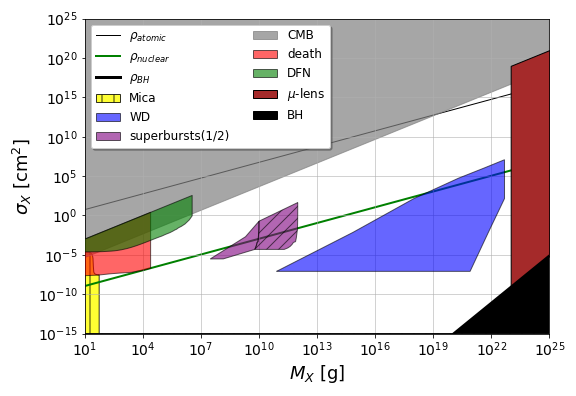

.. _macro_lightning-plot:

*****************************
Plot (`macro_lightning.plot`)
*****************************

.. currentmodule:: macro_lightning.plot

This module provides functions to plot macro phase-space constraints. Of particular note is `~constraints_plot` which allows very easy creation of a standardized constraint plot.

.. code-block:: python
	
	with plot.constraints_plot(
	    m_arr=m_arr, sigmin=sigmin, sigmax=sigmax,
	    all_constrs=True, constr_labels=True,
	    savefig="figures/full_constraints_plot.png"
	):
	    # any custom constraints can be plotted here

Reference/API
=============

.. automodapi:: macro_lightning.plot
	:include-all-objects: